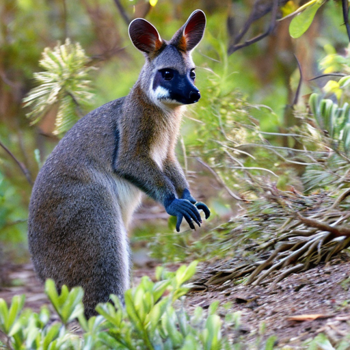

#Huawei NLP course project

[report](asset/Image-To-Prompts.pdf)

# Image to Prompt
A image-to-text model that generate a text description from an image.

<table>
    <tr>
        <th>
            
Image

        </th>
        <th>
            
Prompt

        </th>
    </tr>
    <tr>
        <td>
            

        </td>
        <td>
            
<code>a close up of a small animal in a field </code>

        </td>
    </tr>
</table>

